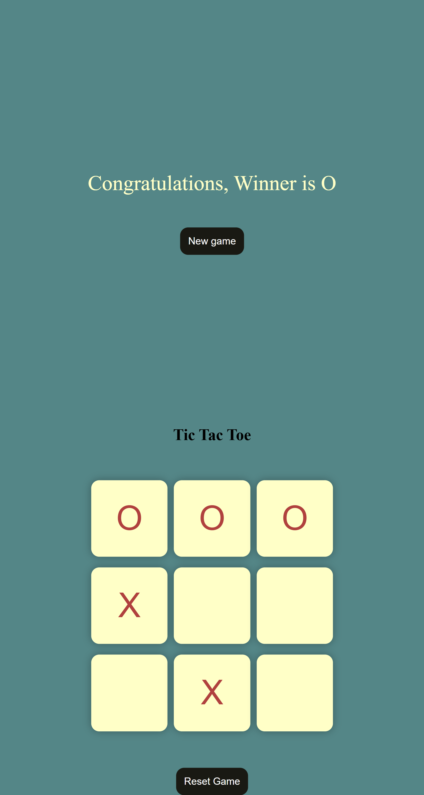

# 🎮 Tic Tac Toe

A responsive and interactive **Tic Tac Toe game** built using **HTML, CSS, and JavaScript**. This project focuses on creating a clean user interface while implementing game logic, player turns, winning conditions, and game reset functionality.

## 🚀 Live Demo

🔗 **Live Demo:** [Add your live demo link here]

## 📌 Features

* 🎮 Two-player Tic Tac Toe gameplay
* 🔄 Automatic player turn switching
* 🏆 Win detection
* 🤝 Draw detection
* 🔁 Restart / New Game functionality
* 🎨 Clean and modern user interface
* 📱 Responsive design
* ⚡ Instant game updates using JavaScript

## 🛠️ Technologies Used

| Technology     | Purpose                                |
| -------------- | -------------------------------------- |
| **HTML5**      | Structure of the game                  |
| **CSS3**       | Styling, layout, and responsive design |
| **JavaScript** | Game logic and interactivity           |

## 📂 Project Structure

```text
Tic-Tac-Toe/
│
├── index.html
├── style.css
├── script.js
└── README.md
```

## ⚙️ How to Run Locally

### 1. Clone the Repository

```bash
git clone https://github.com/Mahnoor-Hassan/tic-tac-toe.git
```

### 2. Open the Project

Navigate to the project directory:

```bash
cd tic-tac-toe
```

### 3. Run the Game

Open `index.html` in your preferred web browser.

No additional installation or dependencies are required.

## 🧠 How the Game Works

The game uses **JavaScript** to control the game logic.

1. Players take turns placing **X** and **O** on the board.
2. JavaScript tracks the selected cells.
3. After each move, the game checks the possible winning combinations.
4. If a player completes a winning combination, the winner is displayed.
5. If all cells are filled without a winner, the game is declared a draw.
6. Players can restart the game and play again.

## 🎯 Project Goals

This project was developed as a frontend practice project to strengthen my understanding of:

* DOM manipulation
* JavaScript event handling
* Conditional logic
* Arrays and game-state management
* HTML structure
* CSS layouts and styling
* Responsive web design
* Building interactive web applications

## 📸 Screenshots


```markdown

```

## 🔮 Future Improvements

Some possible improvements for future versions include:

* 🤖 Single-player mode with AI
* 🏆 Scoreboard and match history
* 🎨 Additional themes
* 🔊 Sound effects
* ✨ Animations for winning combinations
* 🌙 Dark/Light mode
* 💾 Persistent score tracking

## 👩‍💻 Author

**Mahnoor Hassan**

Software Engineering Student

🔗 GitHub: [Mahnoor-Hassan](https://github.com/Mahnoor-Hassan)

---

⭐ If you like this project, consider giving the repository a star!
